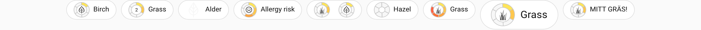
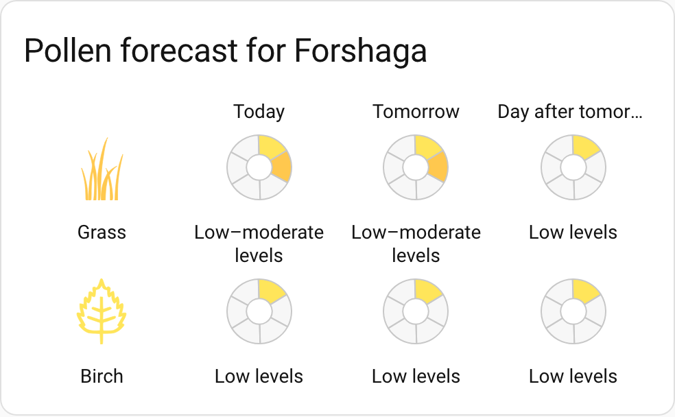
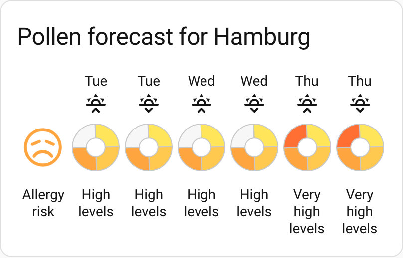
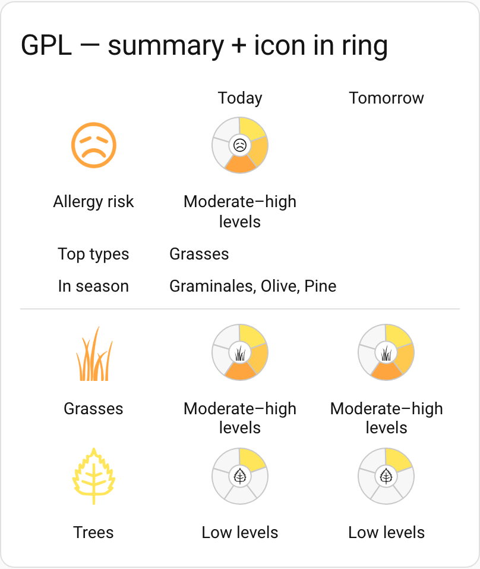
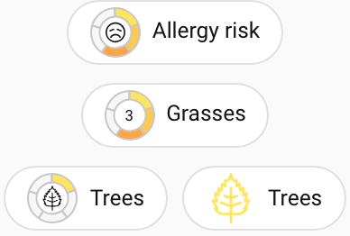

# pollenprognos-card

[![GitHub Release][releases-shield]][releases]
[![License][license-shield]](LICENSE)
[![hacs][hacsbadge]][hacs]
[![Project Maintenance][maintenance-shield]][user_profile]
[![BuyMeCoffee][buymecoffeebadge]][buymecoffee]

A Lovelace card that shows pollen forecasts from several integrations. The card supports Home Assistant's visual editor and works with eleven adapters:

- [Pollenprognos](https://github.com/JohNan/homeassistant-pollenprognos)
- [DWD Pollenflug](https://github.com/mampfes/hacs_dwd_pollenflug)
- [Polleninformation EU](https://github.com/krissen/polleninformation)
- [SILAM Pollen Allergy Sensor](https://github.com/danishru/silam_pollen)
- [Kleenex Pollen Radar](https://github.com/MarcoGos/kleenex_pollenradar)
- [Pollen.lu](https://github.com/Foxi352/pollen_lu)
- [Atmo France](https://github.com/sebcaps/atmofrance)
- [Google Pollen Levels](https://github.com/eXPerience83/pollenlevels)
- [Google Pollen](https://github.com/svenove/home-assistant-google-pollen)
- [MeteoSwiss / hass-swissweather](https://github.com/izacus/hass-swissweather)
- [IRM KMI](https://github.com/jdejaegh/irm-kmi-ha)

<p align="center">
  
</p>

<table align="center">
  <tr>
    <td align="center" valign="top">
      
    </td>
    <td align="center" valign="top">
      
    </td>
  </tr>
  <tr>
    <td align="center">A daily forecast (integration <code>pp</code>): one row per allergen, one level ring per day.</td>
    <td align="center">Other layouts too: <code>twice_daily</code> (above), plus <code>hourly</code> and <code>minimal</code>.</td>
  </tr>
  <tr>
    <td align="center" valign="top">
      
    </td>
    <td align="center" valign="top">
      
    </td>
  </tr>
  <tr>
    <td align="center">An aggregate summary block over the <code>icon_in_ring</code> layout (GPL): overall risk and qualifier rows above the detailed allergens.</td>
    <td align="center">The companion badges for one location, in a few visual styles.</td>
  </tr>
</table>

## Requirements

Install one of the supported integrations above. The card auto-detects which adapter to use based on your sensors.

## Features

- **Multi-Integration Support**: Works with 11 different pollen data sources (Pollenprognos, DWD Pollenflug, Polleninformation EU, SILAM, Kleenex Pollen Radar, Pollen.lu, Atmo France, Google Pollen Levels, Google Pollen, MeteoSwiss, IRM KMI)
- **Auto-Detection**: Automatically detects which integration to use based on your available sensors
- **Visual Editor**: Full Home Assistant UI configuration support - no manual YAML editing required
- **Scalable SVG Icons**: 24+ allergen icons rendered as lightweight, customizable SVG graphics
- **Multiple Display Modes**: Support for minimal, daily, hourly, and twice-daily forecast layouts; icon-in-ring layout places the allergen symbol inside the level ring
- **Badge Element**: Companion `pollenprognos-badge` shows the current pollen level as a compact HA dashboard badge, ships in the same bundle, no extra install needed
- **Full Localization**: Dynamic language support with 15 translations following Home Assistant's language setting
- **Extensive Customization**: Configure colors, layouts, text size, sorting, and display options through the visual editor
- **HACS Integration**: Official HACS repository with automatic updates and easy installation

## Installation

Add `https://github.com/krissen/pollenprognos-card` as a custom repository in HACS and install the card. Reload your browser cache after installation.

## Basic usage

You can configure the card using the Lovelace editor. A minimal YAML configuration looks like this:

```yaml
type: custom:pollenprognos-card
integration: pp       # auto-detected if omitted
city: Stockholm       # adapter specific option
```

## Configuration reference

More details, including all options and example snippets, are available in the documentation:

- [Configuration reference](docs/configuration.md)
- [Integrations and compatibility](docs/integrations.md)
- [Localization and custom phrases](docs/localization.md)
- [Related projects](docs/related-projects.md)

## Support

- 🐛 **Bug reports**: [GitHub Issues](https://github.com/krissen/pollenprognos-card/issues)
- 💬 **Questions & discussions**: [GitHub Discussions](https://github.com/krissen/pollenprognos-card/discussions)
- 📖 **Documentation**: See [docs/](docs/) folder
- 🤝 **Contributing**: See [CONTRIBUTING.md](CONTRIBUTING.md) for guidelines

## Credits

**Project lineage:**

- Original: [pollenprognos-card](https://github.com/isabellaalstrom/lovelace-pollenprognos-card) by [@isabellaalstrom](https://github.com/isabellaalstrom)
- Rewritten as: [pollen-card](https://github.com/nidayand/lovelace-pollen-card) by [@nidayand](https://github.com/nidayand)
- This fork: Extended with multi-integration support and additional features by [@krissen](https://github.com/krissen)

## Contributors

**Maintainer:** [@krissen](https://github.com/krissen)

Thank you to everyone who has contributed to this project:

- [@olanystrom](https://github.com/olanystrom) - Fixed CDN problems
- [@danishru](https://github.com/danishru) - SILAM adapter improvements
- [@hardebusch](https://github.com/hardebusch) - German translation improvements
- [@Krzysztonek](https://github.com/Krzysztonek) - Polish localization
- [@AndreasSkarpelos](https://github.com/AndreasSkarpelos) - Greek localization
- [@r3turnNull](https://github.com/r3turnNull) - MeteoSwiss / hass-swissweather adapter (#212)

---

[Want to support development? Buy me a coffee!](https://coff.ee/krissen)

## License

This project is licensed under the Apache License 2.0 - see the [LICENSE](LICENSE) file for details.

[hacs]: https://hacs.xyz
[hacsbadge]: https://img.shields.io/badge/HACS-Official-blue.svg?style=for-the-badge
[license-shield]: https://img.shields.io/github/license/krissen/pollenprognos-card.svg?style=for-the-badge
[maintenance-shield]: https://img.shields.io/badge/maintainer-%40krissen-blue.svg?style=for-the-badge
[releases-shield]: https://img.shields.io/github/release/krissen/pollenprognos-card.svg?style=for-the-badge
[releases]: https://github.com/krissen/pollenprognos-card/releases
[user_profile]: https://github.com/krissen
[buymecoffee]: https://coff.ee/krissen
[buymecoffeebadge]: https://img.shields.io/badge/buy%20me%20a%20coffee-donate-yellow.svg?style=for-the-badge
