# Supported integrations and compatibility

`pollenprognos-card` can display data from the following Home Assistant integrations:

- [Pollenprognos](https://github.com/JohNan/homeassistant-pollenprognos)
- [DWD Pollenflug](https://github.com/mampfes/hacs_dwd_pollenflug)
- [Polleninformation EU](https://github.com/krissen/polleninformation)
- [SILAM Pollen Allergy Sensor](https://github.com/danishru/silam_pollen)
- [Kleenex Pollen Radar](https://github.com/MarcoGos/kleenex_pollenradar)
- [Pollen.lu](https://github.com/Foxi352/pollen_lu)
- [Atmo France](https://github.com/sebcaps/atmofrance)
- [Google Pollen Levels](https://github.com/eXPerience83/pollenlevels)
- [Google Pollen](https://github.com/svenove/home-assistant-google-pollen)
- [MeteoSwiss / hass-swissweather](https://github.com/izacus/hass-swissweather)
- [IRM KMI](https://github.com/jdejaegh/irm-kmi-ha)

The card tries to auto-detect which adapter to use based on your sensors. The table below lists version requirements and other notes for each integration.

| Integration | Notes |
|-------------|------|
| **Pollenprognos** | For `homeassistant-pollenprognos` **v1.1.0** and higher you need **v1.0.6** or newer of this card. For older integration versions use **v1.0.5** or earlier. |
| **Polleninformation EU** | For `polleninformation` **v0.4.0** or later you need **v2.4.2** or newer of this card. Versions **v0.3.1** and earlier require card version **v2.2.0–v2.4.1**. Forecast modes were added in card **v2.5.0** and require `polleninformation` **v0.4.4** or later. Only the `allergy_risk` sensor supports modes other than `daily`. Dock/sorrel, plantain, sweet chestnut, tree of heaven and linden need `polleninformation` **v0.5.3** or later together with card **v4.1.0** or newer; `linden` replaces the old `lime` key, and configs still naming `lime` keep working. |
| **SILAM Pollen Allergy Sensor** | The card tries to discover SILAM entities via the entity registry when available. If registry data is unavailable, it falls back to entity-id pattern matching; in that case renamed entities may not be detected. For `silam_pollen` **v0.2.7** and newer you need **v2.4.1** or newer of this card. Older integration versions require **v2.3.0–v2.4.0**. When no individual allergen sensors are enabled for a location, the card automatically shows the overall pollen index from the weather entity. **Note:** The integration may report different index values in the entity state vs. the forecast subscription (e.g. `very_low` as the current state but `low` in forecast entries). The card displays whatever each source reports, so `daily` mode and `twice_daily`/`hourly` modes may show slightly different levels for the same location. |
| **DWD Pollenflug** | Keep the default sensor names. You need card version **v2.0.0** or newer. |
| **Kleenex Pollen Radar** | Entities and devices can be renamed; the card discovers them through the entity registry. The optional per-allergen detail sensors (disabled by default) are the exception: they share one translation key, so the allergen must remain the last word of either their entity ID or their friendly name (`Bedroom birch` works, `Birch bedroom` does not). Supports forecasts for Netherlands, UK, France, Italy and USA. Added in card **v2.6.0**. **Note**: The integration reports level as "low" even when ppm values are 0, while the card interprets 0 ppm as "none" level. This different interpretation may affect which allergens appear in the card, and the level of the allergen, as compared to the integration. To confirm what the card shows, open up the relevant sensor in the integration (`trees`, `weeds`, or `grass`). Look at the attributes. Even though the ppm **value** is `0` (no particles in the air) the **level** is shown as `low`. The card would instead show a ppm level of `0` as `none`. **US zones**: the upstream API does not return per-allergen breakdowns for North America, so individual allergens such as `birch` or `oak` can never appear there. Since card **v4.0.1** a US location shows the three category totals instead of an empty card, without any configuration; `allergens: [trees_cat, grass_cat, weeds_cat]` makes the same result explicit. **EU/UK zones**: per-allergen data comes through the category sensors automatically. If individual allergens are missing, try enabling the per-allergen DetailSensor entities in HA (disabled by default in the entity registry under Settings → Devices & Services → Kleenex Pollen Radar). The card will detect and use them as a fallback when category-sensor details are empty. |
| **Pollen.lu** | Keep the default sensor names. The integration exposes current-day pollen levels for Luxembourg with one sensor per allergen. Added in card **v2.8.0**. |
| **Atmo France** | Keep the default sensor names. The integration provides pollen levels (0–6) for French cities with optional J+1 forecasts. Added in card **v2.9.0**. |
| **Google Pollen Levels** | Entity names can be freely renamed or localized; the card detects sensors by their `platform` attribute or `attribution` string, not by entity ID patterns. Works with any Home Assistant language. Supports multi-location setups via separate config entries. Added in card **v2.9.0**. |
| **Google Pollen** | For `home-assistant-google-pollen` by svenove. Uses the same Google Pollen API but a different HA integration. Sensors are detected by the `google_pollen` platform or entity prefix `sensor.google_pollen_*`. Allergens are classified primarily via `unique_id` (language-independent) with `display_name` lookup as fallback, covering all 35 languages the API supports via pre-generated name maps. The API returns up to 4 days of forecast. Supports multi-location setups via separate config entries. Added in card **v3.1.0**. |
| **MeteoSwiss / hass-swissweather** | For [`hass-swissweather`](https://github.com/izacus/hass-swissweather) by [@izacus](https://github.com/izacus). Adapter contributed by [@r3turnNull](https://github.com/r3turnNull) (#212). Sensors are detected by the `swissweather` platform; entity IDs follow `sensor.<device-slug>_pollen_<allergen>_level_at_<station>` (the device-slug prefix is added by HA from the device name and changes if you rename the device via `name_by_user`). MeteoSwiss publishes only current-day measurements, so `days_to_show` is fixed at 1 by the card regardless of config. Categorical levels (`None` / `Low` / `Medium` / `Strong` / `Very Strong`) are mapped to the integration's native 5-level scale (0--4), matching how the card keeps each integration's native level count without stretching onto the shared 0--6 gradient. Allergens supported: birch, grass, alder, hazel, beech, ash, oak. Multi-station setups: pick the station via the `location` field (accepts `config_entry_id` ULID, label, or station code). Added in card **v3.2.0**. |
| **IRM KMI** | For [`irm-kmi-ha`](https://github.com/jdejaegh/irm-kmi-ha) by [@jdejaegh](https://github.com/jdejaegh) (data from the Royal Meteorological Institute of Belgium, meteo.be). Sensors are detected by the `irm_kmi` platform; entity IDs follow `sensor.<location>_<allergen>_level`. IRM KMI publishes only a current-day value, so `days_to_show` is fixed at 1 by the card regardless of config. The meteo.be colour scale is mapped to the card's native 5-level scale (0–4): green=0, yellow=1, orange=2, red=3, purple=4, using the card's default level colours. The non-measurement states `none` (no data / not in season) and the legacy `active` flag are treated as no-data and hidden, so the card shows only allergens with an actual reading. Allergens supported: alder, ash, birch, grass, hazel, mugwort, oak. Multi-location setups (one config entry per location): pick the location via the `location` field (accepts `config_entry_id` ULID, label, or slug). Added in card **v3.4.0**. |

## Card previews per integration

One representative card per integration, rendered from live sensors. Allergen names, level wording and the number of days follow each integration's own data.

<table>
  <tr>
    <td align="center" valign="top">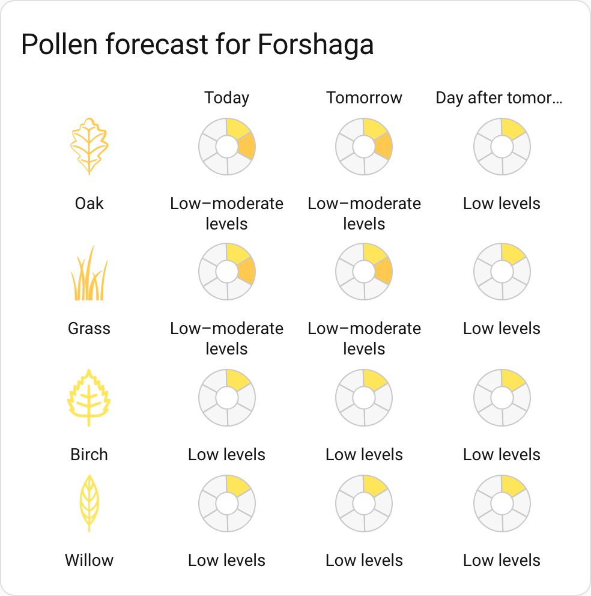 <b>Pollenprognos</b> (Sweden)</td>
    <td align="center" valign="top">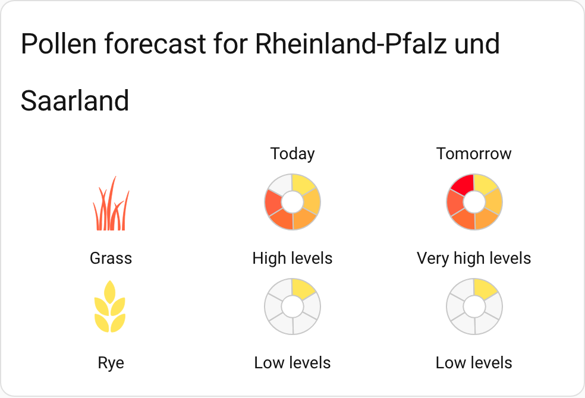 <b>DWD Pollenflug</b> (Germany)</td>
  </tr>
  <tr>
    <td align="center" valign="top">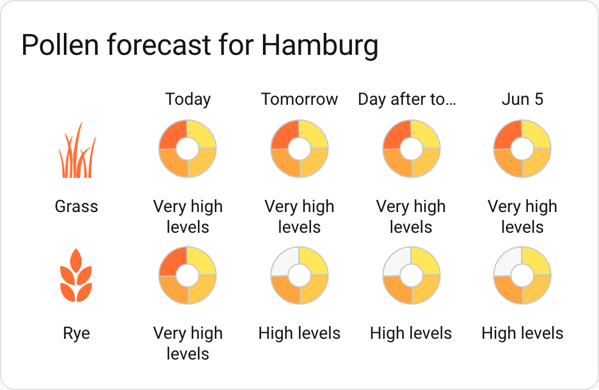 <b>Polleninformation EU</b></td>
    <td align="center" valign="top">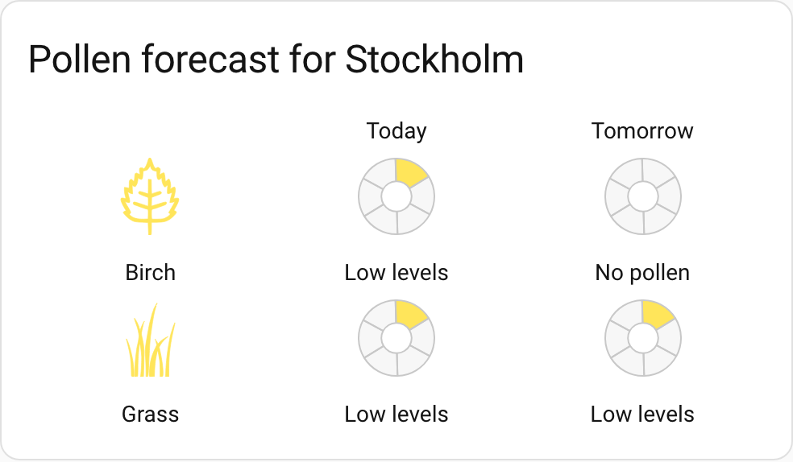 <b>SILAM Pollen Allergy Sensor</b></td>
  </tr>
  <tr>
    <td align="center" valign="top">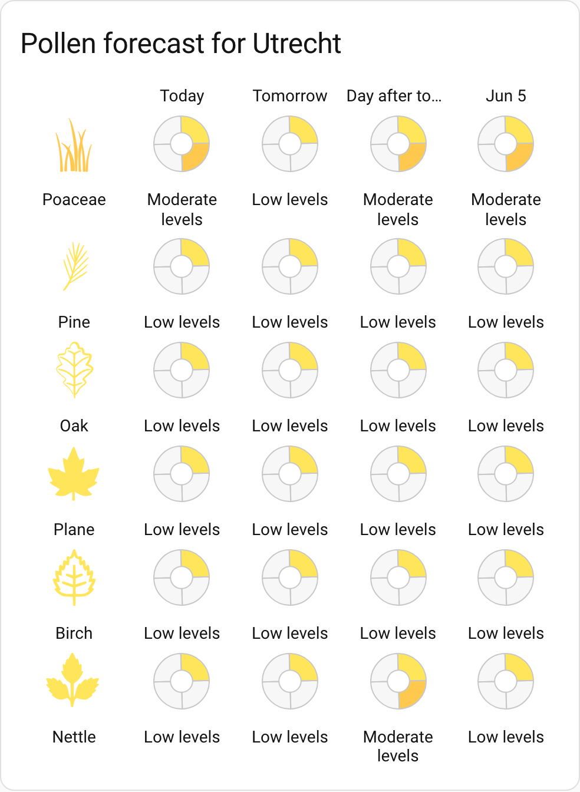 <b>Kleenex Pollen Radar</b> (per-species)</td>
    <td align="center" valign="top">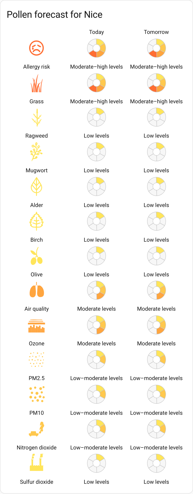 <b>Atmo France</b></td>
  </tr>
  <tr>
    <td align="center" valign="top">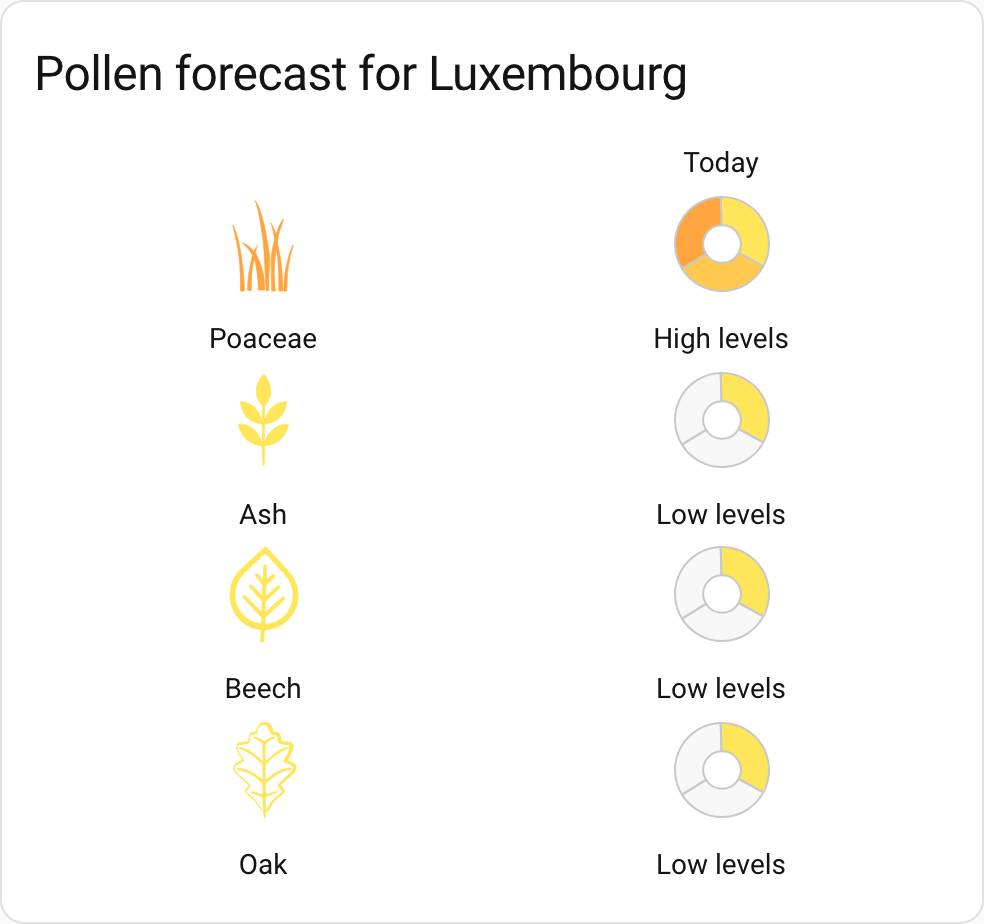 <b>Pollen.lu</b> (Luxembourg)</td>
    <td align="center" valign="top">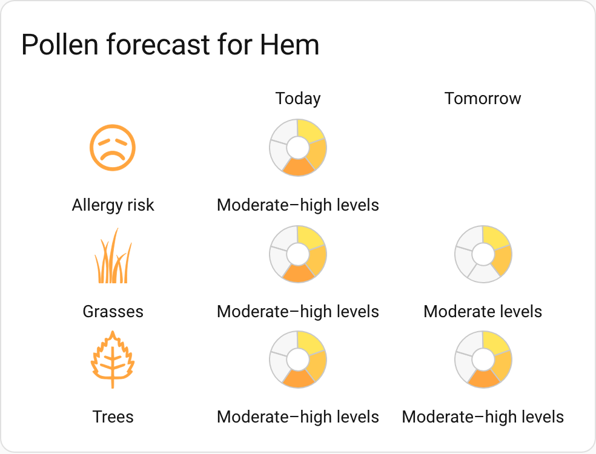 <b>Google Pollen Levels</b></td>
  </tr>
  <tr>
    <td align="center" valign="top">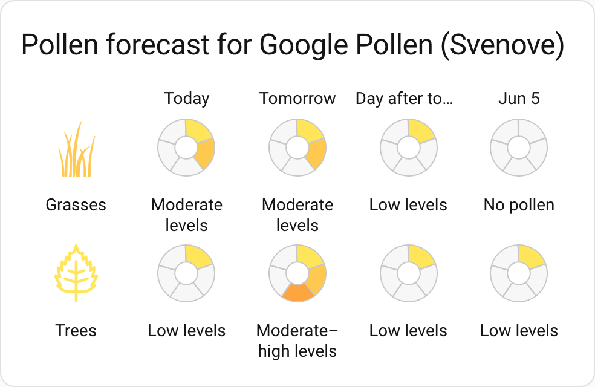 <b>Google Pollen</b> (svenove)</td>
    <td align="center" valign="top">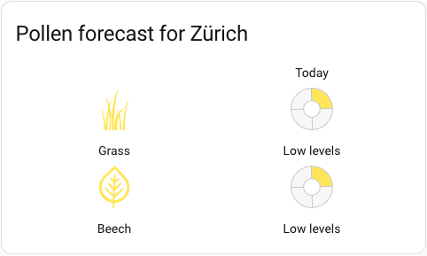 <b>MeteoSwiss / hass-swissweather</b></td>
  </tr>
  <tr>
    <td align="center" valign="top">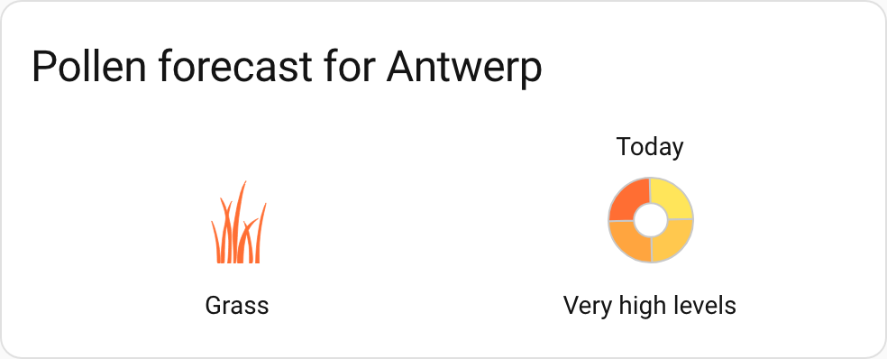 <b>IRM KMI</b> (Belgium)</td>
  </tr>
</table>

## Badge compatibility

The `pollenprognos-badge` element works with all integrations listed above. Configure it with the same `integration`, location (`city`, `region_id`, or `location` depending on the integration), and `allergens` keys as the card.

`badge_content: aggregate` uses the integration's overall-risk sensor (the one the card tags as the summary). This is available out of the box for **GPL** (`allergy_risk`) and **Atmo** (`allergy_risk`, the pollen aggregate; Atmo's `qualite_globale` is air quality and is not used as the aggregate). For **SILAM** the aggregate is the index, but SILAM does not enable it by default, so add `index` to the badge's `allergens`. SILAM also drops the index on low-pollen days under the default `pollen_threshold: 1` (level 0 is filtered out), so set `pollen_threshold: 0` on the badge to keep it visible when low. For all other integrations, and for SILAM without the index, the badge automatically falls back to `badge_content: worst` (the allergen with the highest current level).

## Google Pollen Levels: design decisions

The Google Pollen Levels (GPL) adapter uses a different detection strategy than the other adapters. This section explains the design choices and how sensor discovery works.

### Why attribute-based detection

Most adapters in this card detect sensors by matching entity ID patterns with regular expressions. For example, the DWD adapter looks for `sensor.dwd_pollenflug_*` and the Pollenprognos adapter matches `sensor.*_stockholm`.

This approach does not work for the `pollenlevels` integration because Home Assistant translates entity IDs into the user's language. A Swedish setup creates `sensor.stockholm_typer_pollen_gras`, but a Russian setup creates `sensor.hem_tipy_pyltsy_trava`. No single regex can match all languages.

The GPL adapter instead uses **attribute-based detection**: it examines sensor metadata (platform, attribution, icon, code) rather than the entity ID string. This makes it work regardless of the Home Assistant language or any entity renaming the user may have done.

### Sensor discovery

The adapter tries two detection paths in order:

1. **Primary (`hass.entities`)**: Filters by `platform === "pollenlevels"` and excludes diagnostic sensors (`entity_category` is set on meta sensors like region, date, last_updated). This path also provides `device_id` for grouping sensors into locations.

2. **Fallback (`hass.states`)**: Scans all sensors for `attributes.attribution === "Data provided by Google Maps Pollen API"` and excludes `device_class: "date"` / `"timestamp"`. Used when `hass.entities` is not available or returns no results.

### Sensor classification

Each sensor is classified as either a **type sensor** (category) or a **plant sensor** (individual allergen):

| Check | Classification | Key |
|-------|---------------|-----|
| Has `attributes.code` | Plant sensor | `code` value, e.g. `"birch"`, `"oak"` |
| No `code`, `icon` = `mdi:grass` | Type sensor | `grass_cat` |
| No `code`, `icon` = `mdi:tree` | Type sensor | `trees_cat` |
| No `code`, `icon` = `mdi:flower-tulip` | Type sensor | `weeds_cat` |

The `code` attribute is always in English regardless of the Home Assistant language. The icon values come from the integration's `TYPE_ICONS` dictionary and are stable across versions.

**The `graminales` plant key.** Google's grass *plant* code `GRAMINALES` is classified to the canonical key `graminales`, kept deliberately **distinct** from the grass *category* (`grass_cat`) and **not** aliased to `grass` (the same separation the GP adapter relies on for collision handling — see [Google Pollen (svenove)](#sensor-classification-1) below). Its display label uses Google's own per-language plant `displayName` (sourced from the Pollen API: e.g. `de` "Gräser", `es` "Gramíneas", `it` "Piante erbacee"). In several languages that name reads the same as the grass category — this **mirrors Google's own output** (the integration shows the same), not a card bug. Allergen labels in the editor resolve through `editor.phrases_full/short.<key>` → `card.allergen.<key>` → a capitalized humanized fallback, so a code without a localized string is shown as a readable name rather than a raw translation key.

### Multi-location support

When the primary detection path is available, the adapter groups sensors by `config_entry_id` (resolved via the device registry). Each `pollenlevels` config entry represents one location. The card stores the `config_entry_id` in the `location` field and shows human-readable labels derived from device names in the editor dropdown.

If only the fallback path is available, all sensors are grouped into a single default location.

### Level scale

Google Pollen API uses a 0–5 scale. The card keeps this scale as-is and displays 5 segments in the doughnut chart (one per active level, excluding level 0 "None"). Level names are mapped to the card's standard terminology the same way as for Kleenex and PEU; the raw level is preserved for sorting and thresholds while the display text is looked up from the card's localized level name table.

### Summary block (Pollen Levels v2.1.0)

Pollen Levels v2.1.0 adds an `overall_pollen_risk_today` sensor (mapped to the canonical `allergy_risk` key) and two sibling summary sensors. The card's summary block (`show_summary_block`) renders `allergy_risk` as a pinned row and, for GPL, two optional qualifier rows below it. Two design choices are worth noting:

- **Top types are localized in the card's language, not the integration's.** The dominant pollen categories come from the summary sensor's `top_pollen_codes` (`TREE` / `GRASS` / `WEED`). Each code is mapped to the canonical category key (`trees_cat` / `grass_cat` / `weeds_cat`) and translated via the card's own locale files. The integration also ships pre-localized `top_pollen_names`, but those reflect whatever language that config entry fetched in (which may differ from the card), so they are used only as a per-item fallback for codes the card has no translation for.
- **The in-season list comes from a sibling entity, resolved by config entry.** The plant list lives on the separate `plants_in_season_today` entity (`plant_codes` / `plant_names`), not on the summary entity. pollenlevels splits one location across several devices (pollen types vs plants), so the adapter resolves the sibling by **config entry** (not by device), matching on `translation_key` (the frontend's reduced `hass.entities` does not always expose `unique_id`). Plant names are localized the same way as the top types.

### Attribution

Google's Pollen API attribution policy requires the data to be credited wherever it is shown, so the card does it for you: a footer under the card carries the "Google Maps" wordmark and the line "Source: Includes pollen data from Google". Both strings are shown verbatim in English and are never translated, because the policy prescribes their wording. The visual editor repeats the attribution under the integration picker.

The badge is the one place this does not fit. A badge pill is roughly 36 px wide, and the wordmark may not widen it, so a full attribution would shrink to an illegible sliver. The badge therefore shows the square Google Maps pin in its corner at the policy's 16 dp minimum, with the full attribution string as a hover title. Two deliberate trade-offs are hidden in that sentence: the source line is only visible on hover rather than always, and the pin is Google's product logo, not one of the assets from their attribution package (which ships the wordmark only). Both are concessions to the format, and both apply to the badge alone.

Attribution is on by default and can be turned off with `show_google_attribution: false`, which hides the card footer and the badge pin but not the editor row. See [configuration.md](configuration.md) for the caveat that comes with turning it off.

## Google Pollen (svenove): design decisions

The Google Pollen (GP) adapter supports the [home-assistant-google-pollen](https://github.com/svenove/home-assistant-google-pollen) integration by svenove. Both GP and GPL use the same underlying Google Pollen API, but the two HA integrations expose data in different formats.

### Differences from GPL

| Aspect | GPL (`pollenlevels`) | GP (`google_pollen`) |
|--------|---------------------|---------------------|
| Allergen identification | `code` attribute + icon mapping | `display_name` attribute |
| Forecast format | `attributes.forecast[]` array | Flat attributes: `tomorrow`, `day 3`, `day 4` |
| Today's level | `sensor.state` (numeric) | `attributes.index_value` (numeric); state is text category |
| Max forecast days | 5 | 4 |
| Attribution string | `"Data provided by Google Maps Pollen API"` | None |

### Sensor discovery

1. **Primary**: `hass.entities` filtered by `platform === "google_pollen"`, excluding diagnostic sensors.
2. **Fallback**: Entity IDs starting with `sensor.google_pollen_`.

### Sensor classification

Each sensor is classified as either a **category sensor** or an **individual plant sensor**. The adapter tries two strategies in order:

| Strategy | When used | How it works | Example |
|----------|-----------|-------------|---------|
| `unique_id` extraction | `hass.entities` available | Extract code from `google_pollen_{code}_{lat}_{lon}` | `google_pollen_birch_59.33_18.07` -> `birch` |
| `display_name` lookup | Fallback when `unique_id` unavailable | Trim + lowercase, then look up in `GP_DISPLAY_NAME_MAP` | `"Björk"` -> `birch` |

Category codes from `unique_id` are mapped to canonical keys:

| `unique_id` code | Allergen key |
|-----------------|-------------|
| `grass` | `grass_cat` |
| `tree` | `trees_cat` |
| `weed` | `weeds_cat` |

Plant codes (e.g. `birch`, `oak`, `ragweed`) are kept as-is.

**Collision handling**: In some languages, a category sensor and a plant sensor share the same `display_name` (e.g. Swedish "Gräs" for both the GRASS category and the GRAMINALES plant). When this happens, the first sensor gets the category key and the second is reclassified as a plant via `GP_COLLISION_PLANTS`.

### Multi-location support

Like GPL, the adapter groups sensors by `config_entry_id` (resolved via the device registry). Each `google_pollen` config entry represents one location. The card stores the `config_entry_id` in the `location` field and shows human-readable labels derived from device names (preferring `name_by_user` if the user has renamed the device) in the editor dropdown.

If only the fallback detection path is available (no `hass.entities`), all sensors are grouped into a single default location.

### Level scale

Same as GPL: 0-5 UPI scale, mapped to the card's 6-level display system.

### Attribution

Same as GPL, since GP draws on the same Google Pollen API: the card renders the "Google Maps" wordmark and the "Source: Includes pollen data from Google" line as a footer, the editor repeats it under the integration picker, and the badge shows the Maps pin with the full string on hover. See [Attribution](#attribution) under GPL for the reasoning behind the badge's two deviations, and `show_google_attribution` in [configuration.md](configuration.md) for the opt-out.
