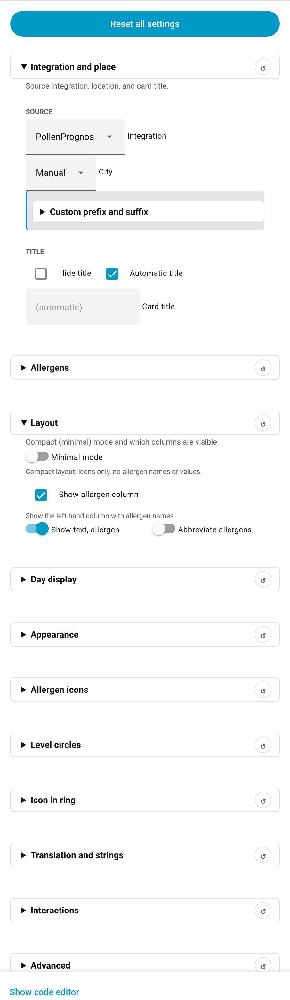
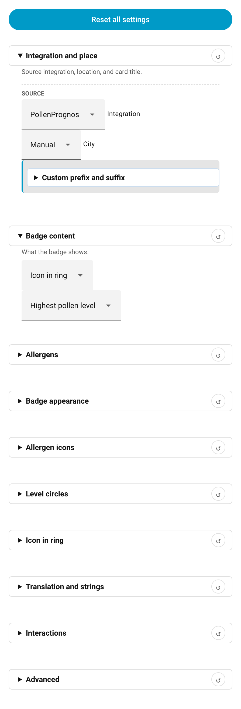
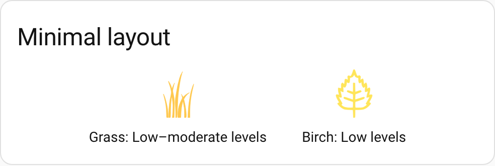
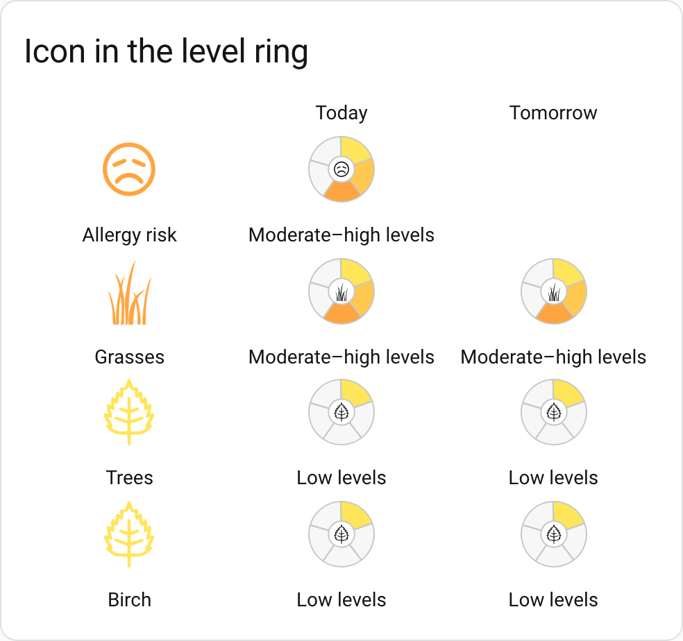

# Quick Start Guide

Get your first pollenprognos-card up and running in minutes!

## Prerequisites

Before starting, make sure you have:

- ✅ Installed a pollen data integration (see [installation.md](installation.md))
- ✅ Installed the pollenprognos-card via HACS
- ✅ Verified that pollen sensors are showing in Developer Tools → States

## Adding Your First Card

<p align="center">
  
</p>

### Using the Visual Editor (Recommended)

The easiest way to add the card is using Home Assistant's visual editor:

1. **Open your dashboard**
   - Navigate to the dashboard where you want to add the card
   - Click "Edit Dashboard" in the top right corner

2. **Add the card**
   - Click "Add Card" button
   - Search for "Pollenprognos" or scroll to find "Custom: Pollenprognos Card"
   - Click to select it

3. **Configure the card**
   - The editor will auto-detect your pollen integration and location
   - Select which allergens you want to display
   - Customize appearance if desired (colors, size, layout, etc.)
   - Click "Save"

4. **Done!**
   - Your pollen forecast card is now showing
   - Click "Done" in the top right to exit edit mode

The editor groups options into collapsible sections. Each section header has a ↺ button that resets just that section, and **Reset all settings** at the top clears everything back to defaults.

<p align="center">
  
</p>

### Using YAML

If you prefer YAML configuration, add this to your Lovelace configuration:

```yaml
type: custom:pollenprognos-card
integration: pp # auto-detected if omitted
city: Stockholm # your city (for Pollenprognos)
```

**For other integrations:**

```yaml
# DWD Pollenflug (Germany)
type: custom:pollenprognos-card
integration: dwd
region_id: "31" # your region code

# Polleninformation EU
type: custom:pollenprognos-card
integration: peu
location: stockholm

# SILAM Pollen
type: custom:pollenprognos-card
integration: silam
location: stockholm # set explicitly if autodetection misses your location

# Kleenex Pollen Radar
type: custom:pollenprognos-card
integration: kleenex
location: amsterdam

# Pollen.lu (Luxembourg)
type: custom:pollenprognos-card
integration: plu

# Atmo France
type: custom:pollenprognos-card
integration: atmo
location: lyon

# Google Pollen Levels (global)
type: custom:pollenprognos-card
integration: gpl

# Google Pollen (svenove, global)
type: custom:pollenprognos-card
integration: gp

# MeteoSwiss / hass-swissweather (Switzerland)
type: custom:pollenprognos-card
integration: msw
# location auto-detected; set config_entry_id, label or station code for multi-station setups

# IRM KMI / meteo.be (Belgium)
type: custom:pollenprognos-card
integration: irmkmi
# location auto-detected; set config_entry_id, label or slug for multi-location setups
```

## Adding a Badge

The card bundle also ships a companion badge element. Badges appear in the top strip of a dashboard view and give you a compact, at-a-glance pollen indicator.

<p align="center">
  
</p>

**Via the badge picker:**

1. Edit your dashboard and click **Add Badge**
2. Search for "Pollenprognos Badge" and select it
3. Configure integration, location, and content mode in the visual editor (a specific allergen is only selected in the `single` content mode)
4. Click **Save**

<p align="center">
  
</p>

**Via YAML** (add to the `badges:` list of a view, not `cards:`):

```yaml
badges:
  - type: custom:pollenprognos-badge
    integration: pp
    city: Stockholm
    badge_content: worst
    badge_visual: icon_in_ring
```

See [configuration.md](configuration.md#badge) for all badge options and [installation.md](installation.md#using-the-badge) for more detail.

## Common Customizations

### Minimal Layout

Perfect for compact dashboards:

```yaml
type: custom:pollenprognos-card
city: Stockholm
minimal: true
icon_size: 32
```

<p align="center">
  
</p>

### Select Specific Allergens

Only show allergens you care about:

```yaml
type: custom:pollenprognos-card
city: Stockholm
allergens:
  - Björk
  - Gräs
  - Hassel
```

### Custom Colors

Match your Home Assistant theme:

```yaml
type: custom:pollenprognos-card
city: Stockholm
levels_colors:
  - "#FFE55A"
  - "#FFC84E"
  - "#FFA53F"
  - "#FF6E33"
  - "#FF6140"
  - "#FF001C"
background_color: "var(--card-background-color)"
```

### Icon Inside the Ring

Display the allergen icon inside the level ring instead of above it:

```yaml
type: custom:pollenprognos-card
city: Stockholm
icon_in_ring: true
icon_in_ring_color_mode: follow_level
```

<p align="center">
  
</p>

The editor automatically adjusts `levels_thickness` to give the icon room. See [configuration.md](configuration.md#options) for `icon_in_ring_size_ratio` and `icon_in_ring_static_color`.

### More Days

Show a longer forecast:

```yaml
type: custom:pollenprognos-card
city: Stockholm
days_to_show: 7
```

## Display Modes

The card supports different display modes depending on your integration:

### Daily Mode (All integrations)

Shows daily forecast columns:

```yaml
type: custom:pollenprognos-card
city: Stockholm
mode: daily # default
```

### Hourly Mode (SILAM, PEU)

Shows hourly forecasts:

```yaml
type: custom:pollenprognos-card
integration: silam
location: stockholm
mode: hourly
```

### Twice Daily (SILAM, PEU)

Shows morning and evening forecasts:

```yaml
type: custom:pollenprognos-card
integration: silam
location: stockholm
mode: twice_daily
```

## Examples by Region

### Sweden (Pollenprognos)

```yaml
type: custom:pollenprognos-card
integration: pp
city: Stockholm
allergens:
  - Björk
  - Gräs
  - Al
  - Hassel
days_to_show: 5
```

### Germany (DWD Pollenflug)

```yaml
type: custom:pollenprognos-card
integration: dwd
region_id: "31" # Niedersachsen und Bremen
allergens:
  - Birke
  - Gräser
  - Hasel
  - Erle
```

### Netherlands (Kleenex Pollen Radar)

```yaml
type: custom:pollenprognos-card
integration: kleenex
location: amsterdam
allergens:
  - trees_cat
  - grass_cat
  - weeds_cat
```

### Luxembourg (Pollen.lu)

```yaml
type: custom:pollenprognos-card
integration: plu
allergens:
  - birch
  - grass
  - hazel
  - alder
```

### France (Atmo France)

```yaml
type: custom:pollenprognos-card
integration: atmo
location: lyon
allergens:
  - birch
  - grass
  - ragweed
  - olive
days_to_show: 2
```

### Global (Google Pollen Levels)

```yaml
type: custom:pollenprognos-card
integration: gpl
allergens:
  - grass_cat
  - trees_cat
  - weeds_cat
  - birch
  - olive
days_to_show: 5
```

### Global (Google Pollen -- svenove)

```yaml
type: custom:pollenprognos-card
integration: gp
allergens:
  - grass_cat
  - trees_cat
  - weeds_cat
  - birch
  - ragweed
days_to_show: 4
```

### Switzerland (MeteoSwiss)

```yaml
type: custom:pollenprognos-card
integration: msw
allergens:
  - birch
  - grass
  - alder
  - hazel
# days_to_show fixed at 1 (upstream provides today only); five-level scale.
# For multi-station setups, pick the station via the visual editor or set
# location: <config_entry_id> | <label> | <postal-code>.
```

### Belgium (IRM KMI)

```yaml
type: custom:pollenprognos-card
integration: irmkmi
allergens:
  - alder
  - birch
  - grass
  - mugwort
# days_to_show fixed at 1 (meteo.be provides today only); five-level colour scale.
# For multi-location setups, pick the location via the visual editor or set
# location: <config_entry_id> | <label> | <slug>.
```

## Next Steps

Now that you have a basic card running, explore more options:

- 📖 **Full configuration reference**: [configuration.md](configuration.md)
- 🌍 **Translation and custom phrases**: [localization.md](localization.md)
- 🔧 **Integration-specific settings**: [integrations.md](integrations.md)
- 🎨 **Advanced customization**: See the color system in [configuration.md](configuration.md#color-system-overview)

## Troubleshooting

If something is not working, see the [Troubleshooting Guide](troubleshooting.md) for step-by-step solutions to common issues:

- [No sensors found](troubleshooting.md#no-pollen-sensors-found)
- [Allergens missing](troubleshooting.md#allergens-missing-from-the-card)
- [Cache and version problems](troubleshooting.md#cache-and-version-problems)
- [Is it a card issue or an integration issue?](troubleshooting.md#is-it-a-card-issue-or-an-integration-issue)

## Getting Help

- 🐛 Report bugs: [GitHub Issues](https://github.com/krissen/pollenprognos-card/issues)
- 💬 Ask questions: [GitHub Discussions](https://github.com/krissen/pollenprognos-card/discussions)
- 📖 Full documentation: [docs/](.)
